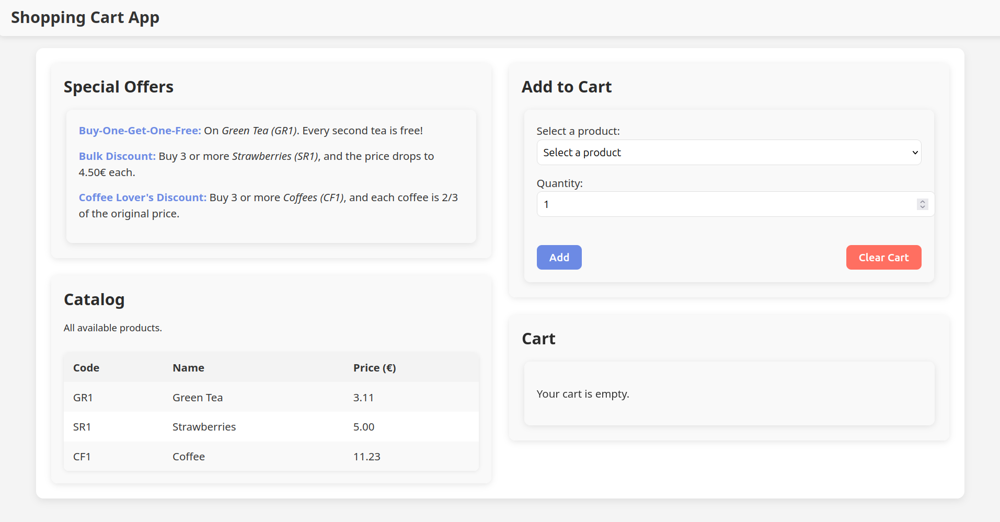

---

### Project Documentation: Cash Register Application

---

#### **1. Project Overview**
The Cash Register application was developed as part of a technical challenge to create a flexible, user-friendly system for managing a shopping cart. This system handles product additions, calculates the total price, and applies special pricing rules to meet the requirements provided. The main goals of the project included simplicity, maintainability, and scalability while adhering to a test-driven development methodology.



The core functionality revolves around three special pricing rules:
1. **Buy-One-Get-One-Free**: Applies to Green Tea (GR1).
2. **Bulk Discount**: Reduces the price of Strawberries (SR1) to €4.50 when purchasing 3 or more.
3. **Conditional Discount**: Decreases the price of Coffee (CF1) to two-thirds of its original value when buying 3 or more.

<video controls width="800">
  <source src="assets//demonstration_video.mp4" type="video/mp4">
  Your browser does not support the video tag.
</video>


#### **2. Technical Requirements**
**Backend**:
- **Language & Framework**: Python with FastAPI.
- **Reason for Choice**: FastAPI was chosen for its simplicity, structured approach, OpenAPI support, and seamless type definition generation for frontend integration.
- **Business Logic**: Encapsulated in modular Python classes:
  - **Catalog**: Stores product information, including codes, names, and prices.
  - **Cart**: Manages the state of the user's cart, including adding and clearing items.
  - **Pricing Engine**: Implements flexible, extendable business rules for applying discounts and price modifications.
  - **Models**: FastAPI models provide clear API request/response definitions and type safety for the frontend.

**Frontend**:
- **Framework**: React with TypeScript.
- **Styling**: Custom CSS.
- **Build Tool**: Vite for rapid and efficient development.
- **Integration**: Leverages OpenAPI-generated TypeScript types for consistency and error-free communication with the backend.

**Testing**:
- **Backend**: Tests were written using Pytest, covering core business logic and API endpoints. These tests validate:
  - Special pricing rules.
  - Cart management (e.g., adding and clearing items).
- **Frontend**: Testing was not completed due to time constraints, but Vitest was intended as the testing suite.
- **Automation**: GitHub Actions automatically execute backend tests upon code pushes and pull requests to ensure quality and reliability.

---

#### **3. System Design**
**Architecture**:
- Backend and frontend are decoupled, ensuring scalability and independent development cycles.
- The backend serves as the API provider, while the frontend handles user interactions and visualization.

**Core Features**:
- Add products to a shopping cart.
- Apply pricing rules dynamically.
- Provide a detailed breakdown of itemized costs and discounts.

**Pricing Rules**:
- **Buy-One-Get-One-Free** for Green Tea (GR1).
- **Bulk Discount**: €4.50 per unit for Strawberries (SR1) when buying 3 or more.
- **Conditional Discount**: Two-thirds price for Coffee (CF1) when purchasing 3 or more.

**Documentation**:
- The project documentation is available online at [https://icalamesa.github.io/cash-register/](https://icalamesa.github.io/cash-register/).
- Alternatively, the API Swagger Documentation can be viewed locally by running the FastAPI server (`uvicorn app.main:create_app --reload --factory`) and navigating to [http://127.0.0.1:8000/docs](http://127.0.0.1:8000/docs).

---

#### **4. API Features**
**Endpoints**:
1. **`POST /cart/add`**:
   - **Description**: Add a product to the cart by providing its code and quantity.
   - **Request Body**:
     ```json
     {
       "code": "string",
       "quantity": "integer"
     }
     ```
   - **Response**:
     ```json
     {
       "message": "Product added to cart successfully"
     }
     ```

2. **`GET /cart/list`**:
   - **Description**: Retrieve all items in the cart, including quantities, original prices, and any applicable discounts.
   - **Response**:
     ```json
     {
       "items": [
         {
           "item": "GR1",
           "quantity": 2,
           "original_price": 6.22,
           "discounted_price": 3.11
         }
       ]
     }
     ```

3. **`POST /cart/clear`**:
   - **Description**: Remove all items from the cart.
   - **Response**:
     ```json
     {
       "message": "Cart cleared successfully"
     }
     ```

4. **`GET /catalog/list`**:
   - **Description**: Retrieve all products in the catalog with their codes, names, and original prices.
   - **Response**:
     ```json
     {
       "items": [
         {
           "code": "GR1",
           "name": "Green Tea",
           "price": 3.11
         }
       ]
     }
     ```

---

#### **5. Usage Instructions**
1. **Installation**:
   - Run `make install` to install all dependencies for both backend and frontend.

2. **Start the Backend**:
   - Use `make backend` to start the FastAPI server.

3. **Start the Frontend**:
   - Run `make frontend` to launch the React application.

4. **Generate TypeScript Types**:
   - Use `make types` to generate TypeScript types from the OpenAPI schema.

5. **Run the Full Application**:
   - Use `make run` to start both the backend and frontend concurrently.

6. **Run Tests**:
   - Execute `make test` to run backend tests.

---
